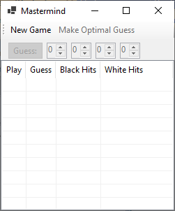
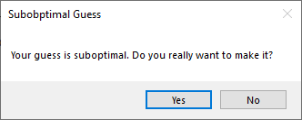

# Homework Assignment 3: Teaching Mastermind

For this assignment, you are to write a program that teaches optimal play for the game *Mastermind*.

## 0. Contents

[TOC]

## 1. User Requirements

Mastermind is a 2-player game in which one player (the *codemaker*) chooses a *code*, and the other player (the *codebreaker*) tries to guess the code using as few guesses as possible. After each guess, the codemaker must provide a *score*, which gives an indication of how close the guess is to being correct. The customer wants a program to help them to break codes optimally. In what follows, we give the rules of the game and define what we mean by optimal play. We then describe the requirements for the program.

### 1.1. Rules

The game consists of an even number of rounds. In successive rounds, the players alternate between the roles of codemaker and codebreaker.

To begin a round, the codemaker selects a code, hidden from the codebreaker. This code is a sequence of four pegs, each of which can be of one of six colors. For our purposes, these six colors are 0, 1, 2, 3, 4, and 5.

The codebreaker then tries to guess this code by making a series of guesses. After each guess, the codemaker scores the guess with the following two values:

- The number of *black hits*: The number of pegs guessed correctly - the correct color in the correct location.
- The number of *white hits*: The maximum number of additional pegs that would be guessed correctly if the incorrect pegs could be reordered.

For example, suppose the code is `0123`. A guess of `0011` would be scored as 1 black hit (the first peg is the correct color) and 1 white hit (the last three pegs in the guess could be reordered as `101`, yielding 1 additional match).

If a guess is scored as 4 black hits, the round ends, and the codemaker received a number of points equal to the number of guesses made by the codebreaker. Additional rules govern cases in which the codemaker incorrectly scores a guess, or if the codebreaker fails to guess the code within a specified maximum number of guesses; however, these rules are unimportant for this program.

### 1.2. Optimal Guesses

There are 1296 possible codes. Let's refer to this set of codes as the *initial goal set*. In general, any subset of these codes can be a goal set. We can think of the initial guess as partitioning the initial goal set into nonempty subsets, each corresponding to a different score; i.e., all of the codes that result in a score of no hits are placed in one set, all those resulting in 1 black hit and no white hits are placed in another, etc. Note that because there are 14 possible scores (the score 3 black hits and 1 white hit is impossible), a guess will partition a goal set into up to 14 nonempty goal sets. The score that is actually given for the guess then selects one of these goal sets as the set of possible solutions. Subsequent guesses further partition the set of possible solutions.

Let *S* be some nonempty goal set. We say that *S* is 1-solvable if it contains exactly 1 element (we can guess this code immediately). For *n* \> 1, we say that *S* is *n*-solvable if there is a guess that partitions *S* into goal sets such that each is either empty or *k*-solvable for some *k* \< *n*. We define the *optimal score* of *S* to be the minimum *n* such that *S* is *n*-solvable. We then say that a guess is *optimal* for *S* if:

- it is the only element in *S*; or
- it partitions *S* such that each nonempty goal set has a smaller optimal score than does *S*.

**Example:** Let *S* = {`1122`, `1212`, `2121`, `2211`}, and consider the guess `1210`. This partitions *S* into the following nonempty goal sets:

- 1 black hit, 2 white hits: {`1122`}.
- 3 black hits, 0 white hits: {`1212`}.
- 0 black hits, 3 white hits: {`2121`}.
- 2 black hits, 1 white hit: {`2211`}.

Each of these goal sets is 1-solvable because it contains only 1 element. *S* is therefore 2-solvable. Furthermore, it can't be 1-solvable because it contains more than 1 element. Its optimal score is therefore 2, and `1210` is an optimal guess. We also note that none of the elements of *S* is an optimal guess, as each one partitions *S* into goals sets such that the set with 2 black hits and 2 white hits has 2 elements.

Our definition of an optimal guess focuses on the worst case. For example, the code that you will write can be used to show that the initial goal set has an optimal score of 5. This means that there is a strategy to break any code in at most 5 guesses. This definition is not the only way of defining optimal guesses. For example, we might consider finding a strategy that minimizes the *expected* number of guesses, assuming codes are chosen randomly with uniform distribution. However, this assumption might not be valid when the codemaker is human. Defining optimality based on the worst case avoids the need to make any assumptions about how the code is chosen.

### 1.3. Specific Requirements

The customer is only interested in a single round of play, where the user is the codebreaker. The code should be chosen randomly from a uniform distribution and kept hidden from the user. The user should then be allowed to make a series of guesses. As each guess is made, the program should determine if the guess is optimal, as defined in [Section 1.2. Optimal Guesses](#1.2. Optimal Guesses). If not, the user should be given the option of trying a different guess instead. For any guess, the user must also be given the option of allowing the program to make an optimal guess. Once the user makes a final decision on a guess, the score of that guess should be reported.

## 2. Starting the Assignment

Create a GitHub repository using the link provided in the Canvas assignment and clone it to your local machine. This repository should contain a Visual Studio solution containing a new Windows Forms Application with an additional unit test project, **Ksu.Cis300.MastermindTeacher.Tests**. Note that no code is provided other than the unit test code. You will need to write the entire program, including designing the GUI.

## 3. User Interface

In this section, we will describe the look and behavior of the GUI that you are to design. We will first outline what you will need to build using the Design window. Then we will describe the required behavior of the GUI. You will need to provide code to implement this behavior (see [Section 6. Coding Requirements](#6-coding-requirements)). The [demo video]() also illustrates the expected look and behavior.

### 3.1. Manual User Interface Design

Using the Design window, design a GUI resembling the following:

The above only shows a part of the GUI. Modifications will be made by code (see [Section 6. Coding Requirements](#6. Coding Requirements)). 

At the top is a **ToolStrip** containing two **Button**s. The "New Game" button is initially enabled, but the "Make Optimal Guess" button is initially disabled. Filling the remainder of the window is a **SplitContainer**. Adding it to the form will cause it to fill the remainder of the window. To cause it to split horizontally, set its **Orientation** property to **Horizontal**. You can then drag the bar that splits the container as you wish, but its final location will be set by code (see [Section 6. Coding Requirements](#6. Coding Requirements)).

In the upper-left corner of the upper panel of the **SplitContainer**, add a **FlowLayoutPanel**. To this **FlowLayoutPanel**, add the "Guess:" button. Then set the **FlowLayoutPanel**'s **AutoSize** property to **True** and its **AutoSizeMode** property to **GrowAndShrink**.

In lower panel of the **SplitContainer**, add a **ListView**, and set its **Dock** property so that it fills the panel. Set its **View** and **GridLines** properties to display the contents as a grid whose rows and columns are separated by lines. Then edit the Columns property, either through its entry in the Properties list or by clicking "Edit Columns..." below the Properties list. In the resulting dialog, use the "Add" button to add a column. Change the **(Name)** property of each column header so that it follows the [naming convention for GUI controls](https://cis300.cs.ksu.edu/appendix/style/naming/index.html), and change each **Text** property to the text to display in the column header. You can also adjust the **Width** properties to make each header's text fully visible, but the final column widths will be set by code (see [Section 6. Coding Requirements](#6. Coding Requirements)).

Finally, resize the form to an appropriate size.

### 3.2. Behavior of the GUI

Once the program is finished, it should initially open a window resembling the following:

At this point, the only enabled control is the "New Game" button. Clicking this button at any time should enable the other two buttons and all four **NumericUpDown**s and generate a code randomly, keeping this code hidden from the user.

The user may then repeatedly do one of the following actions:

- Make a guess by entering the four colors into the **NumericUpDown**s and clicking the "Guess:" button. If the guess is not an optimal guess (see [Section 1.2. Optimal Guesses](#1.2. Optimal Guesses)), a **MessageBox** resembling the following should be displayed:
  
  If the user closes the **MessageBox** with the "No" button, nothing on the GUI should change. If the user closes it with the "Yes" button, or if this **MessageBox** wasn't shown because the guess was optimal, the following changes should be made to the GUI:
  - A value 1 greater than the last value in the "Play" column (or 1 if the "Play" column is empty) should be added to that column.
  - The user's guess should be added to the "Guess" column.
  - The score of this guess should be added to the last two columns. If the number of black hits is 4, the "Make Optimal Guess" and "Guess:" buttons, as well as all four **NumericUpDown**s, should be disabled.
- Click the "Make Optimal Guess" button. The program will then choose an optimal guess and update the GUI as above, using the chosen guess in place of a guess by the user.

## 4. Algorithms

In this section, we'll give the algorithms for finding optimal guesses and for determining whether a given guess is optimal. We first discuss the concept of a *game tree* for a closely-related game. We then present an algorithms for traversing a game tree to find an optimal guess or to determine whether a given guess is optimal. Next, we give some optimizations to the algorithms. Finally, we discuss appropriate data structures for implementing these algorithms.

### 4.1. Game Trees

Consider the following variation of the game. Instead of selecting a code initially, the codemaker delays selecting the code as long as possible. For each guess, the codemaker's responsibility is to assign a score such that at least one code satisfies all of the scores up to that point. Thus, while the codebreaker is trying to minimize the number of guesses, the codemaker is actively trying to maximize the number of guesses. To find an optimal guess, we need to determine which guess the codebreaker will make, on the assumption that both players are playing optimally.

Defining the game in this way makes it similar to other two-player perfect-knowledge games. Specifically, the players alternate making plays, with one player (the codebreaker) trying to minimize the score, and the other player (the codemaker) trying to maximize the score. The main difference from most two-player perfect-knowledge games is that the two players make their plays under different rules.

Having defined this game variation, we can now define a game tree for any position in this game. When it is the codebreaker's turn to play, the game position will be the goal set consisting of all codes consistent with the scores given to all the guesses made up to this point. We will call a node representing such a game position a *minimizing* node, as the codebreaker is trying to minimize the number of guesses. When it is the codemaker's turn, the game position will be the partition of the goal set implied by the codebreaker's last guess (see [Section 1.2. Optimal Guesses](#1.2. Optimal Guesses)). We will call a node representing such a game position a *maximizing* node, as the codemaker is trying to maximize the number of guesses. A minimizing node at which the game isn't over will have 1296 children - the partitions resulting from all possible guesses. A maximizing node will have from 1 to 14 children - the goal sets selected by all legal scorings of the guess. The leaves are the minimizing nodes for which the last score was 4 black hits.

**Example:** Suppose it is the codebreaker's turn to play, and that the current goal set is {`1122`, `1212`, `2121`, `2211`}. Here is a portion of the game tree from this position:

Minimizing nodes are shown with sharp corners, and maximizing nodes are shown with rounded corners. Leaves are shown with heavy borders. For the minimizing nodes, most of the children are not shown, as there are 1296 of them. The children shown are most relevant for the discussion that follows. On the other hand, all of the children of maximizing nodes are shown.

One difficulty in dealing with game trees is that they are infinite. Consider, for example, the node reached by guessing `0000` at the root and scoring no hits. This node is identical to the root; hence, its children will be the same as the root's children. Consequently, an infinite path consisting of repeatedly guessing `0000` and scoring no hits occurs in this tree. This path corresponds to the codebreaker repeatedly guessing `0000` forever. 

Though infinite paths are present in the tree, they have no utility in computing an optimal guess. We can eliminate them by ignoring the following children of any minimizing node:

- If the minimizing node has a goal set with size larger than 1, ignore any child that does not contain at least one smaller goal set than its parent's goal set (note that if at least one goal set is smaller, all goal sets in the partition will be smaller). 
- If the minimizing node has a goal set of size 1, ignore any child other than the one reached by guessing the only member of the goal set.

These children represent wasted guesses - guesses that can provide no new information. When we eliminate these nodes, the sizes of goal sets always decrease as we go from minimizing nodes to maximizing nodes until a goal set of size 1 is reached. Furthermore, they stay the same size when going from maximizing nodes to minimizing nodes. After a goal set of size 1 is reached, the only element of the goal set is guessed, and the game comes to an end. Because minimizing and maximizing nodes alternate, all paths must be finite.

Having simplified the game tree to a finite tree, we can now see how it can be used to determine an optimal guess. At any leaf, the code has been broken; hence, no more guesses are needed. We therefore say the *value* of a leaf is 0. Because the codemaker is trying to maximize the number of guesses, the value of a maximizing node is the maximum of the values of its children. Because the codebreaker is trying to minimize the number of guesses, the value of a minimizing node other than a leaf is the minimum of the values of its children, plus 1 to account for the guess made to reach the child. Using these definitions, the value of a minimizing node will always give the optimal score of the position it represents.

We can now evaluate the root of the above tree to give us the optimal guess. We will work from the bottom, although the algorithm we present below works from the root using recursion. The parents of most of the leaves shown in this tree have only a single child; hence, these maximizing nodes have values of 0. The parents of these maximizing nodes all have only a single child, hence, these minimizing nodes all have values of 1. Consider the two maximizing nodes (shown near the center of the tree) containing two goal sets, {`1212`} and {`2121`}. Each of these nodes has one child with a value of 0 and another child with a value of 1. Maximizing, we see that each of these nodes has a value of 1. Their parent, a minimizing node, has a value 1 more than the minimum of these two values; i.e., it has a value of 2. (Actually, this node has other children that are not shown, but each of them also has a value of 1.)

We have now evaluated every node shown in this tree except the root and its two children (ignoring the rightmost child shown). The children of the maximizing node reached by the guess `1210` all have values of 1; hence, this node has a value of 1. The children of the other maximizing node have values of 0, 2, and 1, respectively; hence, this node has a value of 2. The minimum of these two values is 1 (and none of the root's other children has a value less than 1); hence, the value of the root is 2. An optimal play is therefore `1210` - one leading to a child with minimum value.

Before we formalize the above ideas into algorithms, let's make two additional simplifications of the tree. First, note that any minimizing node whose goal set contains only one element will have a value of 1. We can therefore avoid searching its child and grandchild by immediately giving such a node a value of 1. Having made this simplification, we observe that the only need a maximizing node has for the scores of its goal sets is to determine whether a child is a leaf (this happens when the goal set has a score of 4 black hits). However, because maximizing nodes will always contain some goal sets with scores other than 4 black hits (due to the first simplification), and because a value of 0 will always be the smallest value of any of the children, there is no need to include a goal set having a score of 4 black hits within a maximizing node. This has the effect of eliminating all minimizing nodes with values of 0.

The above game tree with the simplifications described above is shown below. Node values are shown to the right of the nodes. Keep in mind that the minimizing nodes with a goal set containing more than one element still have other children that aren't shown, though they now have fewer than 1296 children.

### 4.2. Basic Algorithms

In this section we present the basic algorithms for determining the best guess and value (or optimal score) at a minimizing node and for determining the value of a maximizing node. In the next two sections, we will give optimizations to these algorithms. These two algorithms will be *mutually recursive*; i.e., they will call each other. We can think of mutually recursive algorithms in the same way as we think about recursive algorithms - as long as the calls to the other algorithm are on children of the current node, we can assume they accomplish what we've specified that they accomplish. (We could combine them into a single recursive algorithm that contains two cases, one for minimizing nodes and one for maximizing nodes, but defining two separate algorithms is cleaner).

These two algorithms are based on the *minimax* strategy for processing game trees for various 2-player games. The strategy is often described as two mutually recursive algorithms: one for minimizing nodes, and one for maximizing nodes. These two algorithms are usually quite similar; however, because the two players of our game play by different rules, our algorithms will have significant differences from each other. Another difference from the more typical minimax strategy is that for most games, the game tree is too large to search all the way to the leaves; hence, an *evaluation function* is typically used to estimate the value of sufficiently-deep nodes. Because our algorithms will search all the way to the leaves of the simplified tree, we won't need an evaluation function.

The minimization algorithm will take as its input a goal set. It will return two values: the optimal score for the given goal set and an optimal guess. Note that the optimal score is the same as the value of the minimizing node representing the given goal set in a game tree.

The maximization algorithm will take as its input a collection of disjoint goal sets. It will return the maximum of the optimal scores of the given goal sets. Note that this value is the same as the value of the maximizing node representing this collection in a game tree. Note also that if we already know the optimal score of some goal set containing more than one element, we can use this algorithm to determine if a given guess is optimal for that goal set: We first partition the goal set according to the given guess, then, ignoring any goal set in this partition that corresponds to 4 black hits, we pass the resulting partition to the maximization algorithm. If this algorithm returns a value less than the optimal score, the given guess is optimal; otherwise, it isn't.

Before presenting the algorithms, we first note that they will not use any data structure representing the game tree. Instead, the structure of the mutual calls will correspond to the game tree; i.e., wherever a minimizing node *x* has a maximizing node *y* as one of its children, the minimization algorithm, when called with the goal set represented by *x*, will call the maximizing algorithm, passing the collection of goal sets represented by *y*.

The basic minimization algorithm is as follows:

1. If the given goal set has only 1 element, return that element as the guess and 1 as the optimal score.
2. Build a collection of key-value pairs containing as its keys all possible guesses that partition the given goal set into smaller goal sets. The value associated with each key should be the resulting partition.
3. Call the maximization algorithm on each key-value pair in this collection. As this loop iterates, keep track of the minimum returned value plus 1 and the key associated with the partition giving this minimum value. 
4. Return the minimum obtained in Step 3 as the optimal score and the key as the optimal guess.

The basic maximization algorithm iterates through the goal sets in the given partition calling the minimization algorithm on each, and maintaining the maximum optimal score returned by that algorithm. It returns this maximum optimal score.

While these algorithms are satisfactory for reasonably small game trees, they will not complete in a reasonable amount of time for the initial goal set, or even for the partition resulting from an initial guess. The next two sections focus on how we can avoid searching large portions of a game tree and still arrive at correct results.

### 4.3. Alpha-Beta Pruning

As we mentioned in [Section 1.2. Optimal Guesses](#1.2. Optimal Guesses), the optimal score for the initial goal set is 5. Furthermore, as the user makes each guess, it makes sense to evaluate the optimal score for the resulting goal set, as a lucky guess might reduce the optimal score by more than 1. Maintaining this optimal score will make it easy to check whether a subsequent guess is optimal by using the maximization algorithm, as outlined above. Because we will always have the optimal score of the root of the game tree, we can use it to  optimize the maximization algorithm. Specifically, if the maximization algorithm ever evaluates a child whose optimal score is at least as large as the optimal score for the root, we know that the guess being evaluated is not optimal. There is therefore no point in continuing the evaluation.

We can generalize this idea by adding an extra parameter to both algorithms. This parameter gives an upper bound on the useful values that could be returned by the algorithm. Thus, if the maximization algorithm ever attains a value greater than or equal to this maximum, it can stop its evaluation, as whatever value it returns won't be used by its parent.

For example, consider again the game tree shown at the end of [Section 4.1. Game Trees](#4.1. Game Trees). After the root has evaluated the guess `1210`, we know that the optimal score is no more than 2. Because we will add 1 to whatever is returned by the maximization algorithm, we can therefore pass 1 as an upper-bound when evaluating the guess `1122`. When the maximization algorithm then evaluates 2 black hits and 2 white hits, the value obtained is 2. There is now no point in evaluating 4 white hits, as whatever is returned will be at least 2, and the minimization algorithm won't use it.

In a similar way, we can also include a lower bound parameter for each algorithm. Whenever the minimizing algorithm attains a minimum value less than or equal to this lower bound, it can stop its evaluation, as the result it computes won't be used.

These optimizations are called *alpha-beta pruning* because the lower- and upper-bounds have traditionally been called &alpha; and &beta;, respectively. We can make this pruning more effective by first evaluation children that are more likely to be optimal. Thus, for the maximization algorithm, it makes sense to consider the goal sets from largest to smallest, as a larger goal set is more likely to have a larger optimal score. For the minimization algorithm, it makes sense to consider first the guesses that yield the partitions having the smallest maximum-sized goal sets, as these are more likely to have a smaller optimal score.

### 4.4. Improved Lower Bounds

In some cases, we can improve the lower bounds we use in alpha-beta pruning by showing that any goal set whose size exceeds a certain threshold must have an optimal score of at least some minimum value. An easy example is that any goal set of size greater than 1 must clearly have an optimal score of at least 2. 

Now suppose that some goal size has a size greater than 14. Any guess will partition this goal set into at most 14 goal sets. By [the pigeonhole principle](https://www2.edc.org/makingmath/mathtools/pigeonhole/pigeonhole.asp), at least one of these goal sets has a size greater than 1, and hence has an optimal score of at least 2. The original goal set must therefore have an optimal size of at least 3.

Finally, suppose that some goal set has a size greater than 175. Again, any guess will partition this goal set into at most 14 goal sets. Furthermore, the goal set resulting from 4 black hits can contain at most 1 element. Consider the goal set resulting from 2 black hits and 2 white hits. There are 6 ways that the 2 black hits can be selected. Once these are selected, the only code with 2 white hits is the one in which the colors of the 2remaining pegs are swapped. Consequently, this goal set can contain at most 6 elements. The other 12 goal sets must then contain a total of more than 168 elements. Because 12 &times; 14 = 168, again by the pigeonhole principle, at least one of these goal sets must contain more than 14 elements. As we showed above, this goal set must have an optimal size of at least 3; hence, the original goal set must have an optimal size of at least 4.

We can utilize these improved lower bounds within the maximization algorithm by initializing the maximum  being found to the maximum of the given lower bound and the appropriate improved lower bound identified above.

Let's now formalize the optimized algorithms. We'll start by revising their specifications.

The minimization algorithm will take as its input a goal set, a lower bound on any useful optimal score, and an upper bound on any useful optimal score. The lower bound must be less than the upper bound. It will again return two values. One of these values will be the optimal score, provided the optimal score is greater than the lower bound and less than the upper bound. In this case, the second value returned is an optimal guess. If the optimal score is less than or equal to the lower bound, instead of returning an optimal score, it will return some value less than or equal to the lower bound. Likewise, if the optimal score is greater than or equal to the upper bound, it will return some value greater than or equal to the upper bound. In either of these last two cases, the guess returned may not be optimal. 

The maximization algorithm will take as its input a collection of disjoint goal sets ordered from largest to smallest, a lower bound on any useful optimal score, and an upper bound on any useful optimal score. The lower bound must be less than the upper bound. It will return the maximum of the optimal scores of the given goal sets, provided this maximum is greater than the lower bound and less than the upper bound. If this maximum is less than or equal to the lower bound, some value less than or equal to the lower bound will be returned. If this maximum is greater than or equal to the upper bound, some value greater than or equal to the upper bound will be returned.

For the minimization algorithm, we will accumulate the minimum of the values returned by the maximization algorithm, then add 1 to this minimum at the end. It therefore will make sense to decrease the given lower- and upper-bounds by 1. Because any value returned by the maximization algorithm will be an upper-bound on any useful subsequent values returned by this algorithm, we can use the upper-bound to accumulate the minimum. The minimization algorithm then operates as follows:

1. If the given goal set has only 1 element, return that element as the guess and 1 as the optimal score.
2. Decrease both the lower- and upper-bound by 1.
3. Build a collection of key-value pairs containing as its keys all possible guesses that partition the given goal set into smaller goal sets. The value associated with each key should be the resulting partition. The goal sets within each partition should be sorted in descending order of their sizes, and the partitions within the collection should be sorted in ascending order of the sizes of the first goal set in each partition.
4. Call the maximization algorithm on each key-value pair in this collection. As this loop iterates, update the upper-bound to the minimum returned value, and keep track of the key associated with the partition giving this minimum value (initialize this key to the first key in the collection). If the upper-bound ever becomes less than or equal to the lower-bound, exit this loop. 
5. Return the upper-bound plus 1 as the optimal score and the key saved in Step 4 as the optimal guess.

For the maximization algorithm, we accumulate the maximum of the values returned by the minimization algorithm as the lower-bound because any value returned by the minimization algorithm will be a lower-bound on any useful subsequent values returned by this algorithm. The maximization then algorithm operates as follows:

1. Update the lower-bound to the maximum of its given value and the appropriate improved lower bound for the first goal set in the given partition as described earlier in this section.
2. Iterate through the goal sets in the given partition calling the minimization algorithm on each, and maintaining the maximum optimal score returned by that algorithm as the lower-bound. Prior to each call, if the lower-bound is greater than or equal to the given upper-bound, return this lower-bound. 
3. Return the lower-bound.

### 4.5. Data Structures

In this section, we discuss the data structures that will be used to implement the above algorithms.

Each code (or guess) will be implemented using a **string** of four characters, each of which is '0', '1', '2', '3', '4', or '5'. We will implement each goal set using a **List\<string\>**, where each **string** is a code. 

When using a guess to form a partition, we need to be able to access the goal set containing the codes resulting in a given score. To facilitate efficient accesses, we use a **Dictionary\<(int, int), List\<string\>\>** to build a partition. The keys in this dictionary are the scores in the form, (*black-hits*, *white-hits*). The value associated with a key is the goal set resulting from that score.

We also need to be able to sort a partition. After the partition is built, we have no need for the score of each partition. It therefore makes sense to copy the values from the dictionary representing the partition to a **List\<List\<string\>\>** at this point. Each element of this list is a goal set in the partition.

Finally, Step 2 of the minimization algorithm needs to build a collection of key-value pairs, where each key is a guess, and its associated value is the partition resulting from this guess. We could use a dictionary, but after the collection is built, we'll need to sort it. Therefore, it makes more sense to use a **List\<KeyValuePair\<string, List\<List\<string\>\>\>\>**.

## 5. Software Architecture

Your program should contain two classes, as shown in the following class diagram:

**UserInterface** implements the GUI. Not all of the **private** methods required for this class are shown in the class diagram - see [Section 6.1. The UserInterface Class](#6.1. The UserInterface Class) for more information. **Strategy** is a **static** class containing methods and constants for finding and checking optimal plays, as well as for scoring plays and partitioning goal sets. You will need to implement both of these classes, as outlined in the coding requirements that follow. In order for the provided unit tests to compile, all **public** members of the **Strategy** class must match those shown in the class diagram; otherwise, you may use different names as long as they obey the [naming conventions](https://cis300.cs.ksu.edu/appendix/style/naming/index.html) for this class.

## 6. Coding Requirements

Specific requirements for each of the classes are given in what follows.

### 6.1. The Strategy Class

This class should be **static**; hence, all of its fields and methods must be either **static** or **const**. It needs seven fields, five **public** methods, and four **private** methods. These are described in what follows.

#### 6.1.1. Fields

Six of the fields needed for this class are described here. Because the seventh field needs to be initialized with a method you will write, it is described in the next section. You will need to define the following fields:

- **public static readonly int** `Colors`: Gives the number of colors used in codes (6).
- **public static readonly int** `Pegs`: The number of pegs comprising a code (4).
- **public static readonly int** `OptimalScore`: The optimal score for a new game (5).
- **public static readonly string** `InitialOptimalGuess`: An optimal guess for the initial goal set. While any guess that has at least two distinct colors will work, we use `"0011"` because it minimizes the size of the largest goal set in the resulting partition.
- A **private const char** giving the smallest color (`'0'`).
- A **private static readonly int[&nbsp;]** initialized to `{ 0, 0, 1, 14, 175 }`. Thus, if a goal set has size greater than value at location *i*, the optimal score of that goal set is at least *i* (see [Section 4.4. Improved Lower Bounds](#4.4. Improved Lower Bounds)). Location 0 will be unused.

#### 6.1.2. All possible codes

You will need a field in which to store all possible codes; however, it will need to be initialized using a **private** method. Therefore, we will first describe the method, then the field.

The method needs no parameters and should return a **List\<string\>** giving all possible codes (i.e., the initial goal set). Begin by initializing a **List\<string\>** to contain the empty string as its only element. Then for each peg:

- Initialize a second **List\<string\>** to an empty list.
- For each **string** in the original list:
  - For each color:
    - Concatenate the color and the **string**, and add the result to the second list.
- Replace the original list with the second list by copying a reference.

Apart from this method, define a **public static readonly List\<string\>** `AllCodes`, and initialize it using this method.

#### 6.1.4. A public static Score method

This method should take as its parameters two **string**s representing codes. One of these codes will be a guess, and the other will be a goal code, but as far as the coding is concerned, it doesn't matter which is which. It should return an **(int, int)** indicating the score of the guess, where the first **int** is the number of black hits, and the second is the number of white hits.

While computing the number of black hits is straightforward, computing the number of white hits is trickier. It turns out to be easier to compute number of total hits (i.e., the sum of the number of black hits and the number of white hits) than to compute the number of white hits directly. The number of white hits can then be computed by subtracting the number of black hits from the number of total hits.

The number of total hits for a given color is the minimum of the number of occurrences of that color in the two given codes. The number of total hits is then the sum the number of total hits for each color. For example, suppose the given codes are `"0211"` and `"1221"`. The following table shows the number of occurrences of each color in each code, and the minimum number of occurrences for each color:

| Color | 0211 | 1221 | Minimum |
| ----- | ---- | ---- | ------- |
| 0     | 1    | 0    | 0       |
| 1     | 2    | 2    | 2       |
| 2     | 1    | 2    | 1       |
| 3     | 0    | 0    | 0       |
| 4     | 0    | 0    | 0       |
| 5     | 0    | 0    | 0       |

The total number of hits is then 3, the sum of the values in the last column above. Because the number of black hits is 2 (indices 1 and 3), the number of white hits is 1. 

We therefore need to count the number of occurrences of each color in each code. To do this, we need two arrays of counters, one for each code. The size of each array should be the number of colors. We also need a counter to keep track of the number of black hits. Then for each location within the codes:

- Increment the appropriate counter for each of the codes. To do this, you'll need to convert a **char** such as '2' to an array index such as 2 (recall how you did this for Homework Assignment 1).
- If the two colors at the current location are the same, increment the number of black hits.

Once this loop has finished, iterate through the locations within the counter arrays to add up the number of total hits (see above). Then compute the number of white hits by subtracting the number of black hits from the number of total hits.

#### 6.1.5. A private static method to compare the sizes of two goal sets

This method should take two parameters of type **List\<string\>**. It should return an **int** that is negative if the first list is longer than the second list, 0 if they have the same size, or positive otherwise. This method will be used by a **List\<List\<string\>\>**'s **Sort** method to sort its elements in descending order of their sizes.

#### 6.1.6. A private static method to compare the sizes of the first elements of two partitions

This method should take two parameters of type **KeyValuePair\<string, List\<List\<string\>\>\>**. It should return an **int** that is negative if the first element of the value in the first pair is shorter than the first element of the value in the second pair, 0 if these two elements have the same size, or positive otherwise. This method will be used by a **List\<KeyValuePair\<string, List\<List\<string\>\>\>\>**'s **Sort** method to sort its elements in ascending order of the sizes of the first elements of their values.

#### 6.1.7. A public static Partition method

This method should take as its parameters a **LIst\<string\>** giving a goal set and a **string** giving a guess. It should return a **Dictionary\<(int, int), List\<string\>\>** giving the partition produced by applying the given guess to the given goal set (see [Section 4.5. Data Structures](#4.5. Data Structures)). Begin by constructing a new dictionary. Then for each code in the given goal set, if the code is different from the given guess:

- Compute the score of the guess relative to the code.
- Retrieve the value associated with this score in the dictionary. If the dictionary doesn't already contain this score as a key, add this key with an empty list as its value.
- Add the code to the retrieved list (or the empty list added).

#### 6.1.8. A public static ToList method

This method should take as its only parameter a **Dictionary\<(int, int), List\<string\>\>** as returned by the above method. It should return a **List\<List\<string\>\>** containing all of the values in the given dictionary, sorted in ascending order of the sizes of their first elements. You can use a **foreach** loop to iterate through either the key-value pairs in the dictionary or through the **List\<string\>**s in the dictionary's [**Values**](https://learn.microsoft.com/en-us/dotnet/api/system.collections.generic.dictionary-2.values?view=net-6.0#system-collections-generic-dictionary-2-values) property. After copying all of the values in the dictionary to a list, sort the list using its [**Sort**](https://learn.microsoft.com/en-us/dotnet/api/system.collections.generic.list-1.sort?view=net-6.0#system-collections-generic-list-1-sort(system-comparison((-0)) method. This method takes as its parameter a [**Comparison\<List\<string\>\>**](https://learn.microsoft.com/en-us/dotnet/api/system.comparison-1?view=net-6.0), which is a *delegate* type - a reference to a method. Here you can simply provide there name of the above method that compares **List\<string\>**s.

#### 6.1.9. A private static method to get all the ways of partitioning a given goal set

This method should take as its only parameter a **List\<string\>** giving a goal set. It should return a **List\<KeyValuePair\<string, List\<List\<string\>\>\>\>** giving the collection of key-value pairs to be used in Step 3 of the minimization algorithm (see [Section 4.4. Improved Lower Bounds](#4.4. Improved Lower Bounds) and [Section 4.5. Data Structures](#4.5. Data Structures)). After constructing a new **List\<KeyValuePair\<string, List\<List\<string\>\>\>\>**, iterate through all of the possible guesses. On each iteration:

- Using the appropriate methods above, obtain the partition that results from applying the current guess to the given goal set. The partition should be in the form of a **List\<List\<string\>\>**.
- If the first **List\<string\>** has fewer elements than the given goal set, add to the **List\<KeyValuePair\<string, List\<List\<string\>\>\>\>** a key-value pair containing the current guess as the key and the partition obtained above as the value.

After the above loop terminates, sort the resulting list using as the comparer the appropriate method above for comparing two **KeyValuePair\<string, List\<List\<string\>\>\>**s.

#### 6.1.10. A public OptimalGuess method and a public NumberOfGuesses method

These methods will implement the mutually recursive minimization and maximization algorithms, respectively, described in [Section 4.4. Improved Lower Bounds](#4.4. Improved Lower Bounds). **OptimalGuess** should take the following parameters:

- A **List\<string\>** giving a goal set.
- An **int** giving a lower-bound on any useful optimal score for the given goal set.
- An **int** giving an upper-bound on any useful optimal score for the given goal set.
- An **out int** through which the optimal score will be returned.

It should return a **string** giving the optimal guess.

**NumberOfGuesses** should take the following parameters:

- A **List\<List\<string\>\>** giving a partition of a goal set.
- An **int** giving a lower-bound on any useful optimal score for the given partition.
- An **int** giving an upper-bound on any useful optimal score for the given partition.

It should return an **int** giving the optimal score.

If, for either of these methods, the given lower-bound is greater than or equal to the given upper-bound, throw an **ArgumentException**. Make use of the appropriate methods above in writing these methods.

### 6.2. The UserInterface Class

For this class, you will need seven **private** fields, three event handlers, and at least two additional **private** methods. You will also need to modify the provided constructor. The fields, event handlers, and constructor are described in what follows. You will need to decide how to break the code into at least two additional **private** methods. In making these decisions, look for places where you can avoid duplicating code by defining a **private** method, as well as for long methods that you can divide into smaller methods.

#### 6.2.1. private fields

You will need the following **private** fields:

- A **readonly NumericUpDown[&nbsp;]** that will contain the four **NumericUpDown**s on the control. Initialize it to a new array, using the appropriate constant from the **Strategy** class for its size.
- A **readonly** [**Random**](https://learn.microsoft.com/en-us/dotnet/api/system.random?view=net-6.0) giving a random number generator. Initialize it to a new instance using no parameters.
- A **string** giving the code chosen by the codemaker. To avoid the need to make this field nullable, initialize it to an empty string.
- An **int** giving the number of guesses made so far in the current game.
- An **int** giving the optimal number of remaining guesses in the current game.
- A **List\<string\>** giving the current goal set. Because it will be properly initialized by the "New Game" event handler, you can initialize it here to a new instance (so that it doesn't need to be nullable).
- A **string** giving an optimal guess for the current goal set. To avoid the need to make this field nullable, initialize it to an empty string.

#### 6.2.2. The constructor

Following the call to **InitializeComponent**, you will need to add code to do the following setup for the GUI:

- Add the **NumericUpDown**s. To each location in the **NumericUpDown[&nbsp;]** field, place a new **NumericUpDown**. Set this contol's properties so that its range will be from 0 to the number of colors minus 1 (use the appropriate constant in the **Strategy** class), so that it will automatically resize itself to fit its contents, and so that it is disabled. Finally, add it to the form using the [**Add**](https://learn.microsoft.com/en-us/dotnet/api/system.windows.forms.control.controlcollection.add?view=windowsdesktop-6.0#system-windows-forms-control-controlcollection-add(system-windows-forms-control)) method of the **FlowLayoutPanel**'s [**Controls**](https://learn.microsoft.com/en-us/dotnet/api/system.windows.forms.control.controls?view=windowsdesktop-6.0#system-windows-forms-control-controls) property.
- Set the the **SplitContainer** to split at the appropriate location. First, set its [**SplitterDistance**](https://learn.microsoft.com/en-us/dotnet/api/system.windows.forms.splitcontainer.splitterdistance?view=windowsdesktop-6.0#system-windows-forms-splitcontainer-splitterdistance) property to the height of the **FlowLayoutPanel**. Then, to prevent the user from changing it, set its [**IsSplitterFixed**](https://learn.microsoft.com/en-us/dotnet/api/system.windows.forms.splitcontainer.issplitterfixed?view=windowsdesktop-6.0#system-windows-forms-splitcontainer-issplitterfixed) property to **true**.
- Set column widths in the **ListView** appropriately. For each **ColumnHeader** in the **ListView**'s [**Columns**](https://learn.microsoft.com/en-us/dotnet/api/system.windows.forms.listview.columns?view=windowsdesktop-6.0#system-windows-forms-listview-columns) property, call its [**AutoResize**](https://learn.microsoft.com/en-us/dotnet/api/system.windows.forms.columnheader.autoresize?view=windowsdesktop-6.0#system-windows-forms-columnheader-autoresize(system-windows-forms-columnheaderautoresizestyle)) method, passing it **ColumnHeaderAutoResizeStyle.HeaderSize**.